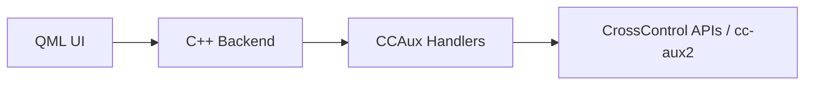

# UiHmiV710

`UiHmiV710` is a Qt 6 / QML human-machine interface project for
CrossControl-style displays and embedded targets. It combines a Qt Quick UI,
backend objects exposed to QML, and hardware-facing handlers for features such
as backlight, buzzer, front LED, power configuration, and version reporting.



## Preview


## Quick Start

Requirements:

- Qt `6.4` or newer
- CMake `3.16` or newer
- A valid Qt Creator kit or command-line CMake toolchain

Example build:

```powershell
cmake -S . -B build
cmake --build build
```

For full hardware integration you will also need CrossControl headers and
runtime libraries under `/opt/crosscontrol/...`.

## Documentation

Full project documentation lives under `docs/`:

- Project docs index: [docs/README.md](docs/README.md)
- Build and run guide: [docs/BUILD_AND_RUN.md](docs/BUILD_AND_RUN.md)
- Architecture notes: [docs/ARCHITECTURE.md](docs/ARCHITECTURE.md)
- Screenshot gallery: [docs/SCREENSHOTS.md](docs/SCREENSHOTS.md)
- Legal and third-party notes: [docs/LEGAL.md](docs/LEGAL.md)
- License index: [docs/LICENSES.md](docs/LICENSES.md)

## Project Structure

Key source areas:

- `backend/` for C++ objects exposed to QML
- `CCAux/` for hardware/device feature handlers
- `components/` for reusable QML controls
- `pages/sections/` for top-level navigation sections
- `pages/features/` for feature pages
- `graphics/` for icons and image assets

## Legal Note

This repository does not currently declare one single root open-source license
for all files. Some files include third-party/vendor copyright notices, and the
project can link against vendor-provided libraries such as `cc-aux2`.

See the root `LICENSE` notice and [docs/LICENSES.md](docs/LICENSES.md) for the
current licensing structure.
