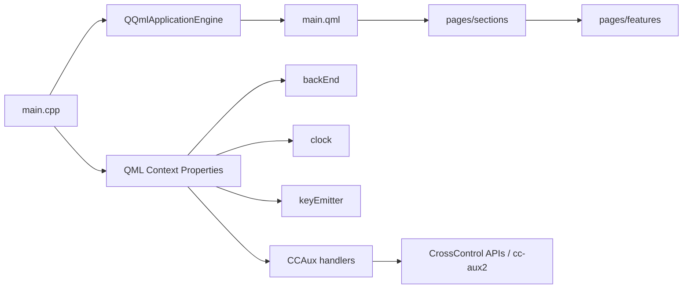

# Architecture

This document gives a practical overview of how `UiHmiV710` is structured.



## High-Level Structure

The application is built from three layers:

- `main.cpp` for application bootstrap and object registration
- QML pages and reusable controls for the UI shell
- C++ backend and hardware-facing handlers for system and device features

## Application Bootstrap

The runtime starts in `main.cpp` and creates a `QQmlApplicationEngine`. The
root QML file loaded by the engine is:

```text
qrc:/UiHmiV710/main.qml
```

Before loading QML, `main.cpp` creates and exposes several backend objects to
the QML context.

## Context Properties Exposed To QML

The following objects are exposed from `main.cpp`:

- `clock`
- `keyEmitter`
- `frontLedHandler`
- `versionHandler`
- `powerConfigHandler`
- `buzzerHandler`
- `backLightHandler`
- `backEnd`

In practice, these objects provide the bridge between QML controls and:

- application state
- keyboard interaction
- hardware status and commands
- version and system metadata

## Main QML Shell

`main.qml` defines the top-level `ApplicationWindow` and the navigation shell.

Important characteristics of the current shell:

- target layout is `800x480`
- navigation is driven by a left-side menu
- content pages are swapped through a `StackView`
- the primary sections are `Setup`, `Diagnostic`, `Connection`, and `Info`

## Page Organization

The page structure is split in two main groups:

- `pages/sections/` for high-level navigation sections
- `pages/features/` for feature-specific pages

Examples of feature pages include:

- `BacklightPage.qml`
- `BuzzerPage.qml`
- `FrontLedPage.qml`
- `PowerPage.qml`
- `VersionsPage.qml`
- `DateTimePage.qml`
- `TouchPage.qml`
- `OrientationPage.qml`

## Backend Layer

The `backend/` directory contains application-facing C++ objects exposed to QML.

Important backend responsibilities include:

- IP address reporting
- display configuration lookup
- hardware button handling
- application state helpers
- clock support
- keyboard event plumbing

The `BackEnd` class is the main general-purpose controller for non-`CCAux`
operations.

## `CCAux` Layer

The `CCAux/` directory contains feature handlers that wrap hardware-dependent
behavior behind Qt-friendly interfaces.

Current handlers include:

- `BackLightHandler`
- `BuzzerHandler`
- `FrontLedHandler`
- `PowerConfigHandler`
- `VersionHandler`

These handlers are the most vendor- and target-specific part of the codebase.

## Build-Time Integration Model

The current build uses conditional integration:

- on `aarch64`, `CCAUX` is enabled and `cc-aux2` is linked
- on `x86_64`, the UI can still be built without the same hardware path

This split is what makes the repository useful both for UI development and for
target-device integration work.

## Resource Model

`qml.qrc` collects the QML files, SVG assets, and bitmaps used by the
application. This resource bundle is what allows the app to load the UI via the
`qrc:/` path at runtime.

## Architectural Tradeoffs

The current structure has a few clear strengths:

- UI work can continue even when hardware access is limited
- feature pages are now separated more cleanly than in earlier demo-style layouts
- QML and C++ responsibilities are easier to trace than in a monolithic setup

The current structure also still has some known tension points:

- hardware-facing code is tightly coupled to vendor APIs
- some historical naming and legacy cleanup traces still exist
- full behavior cannot be validated from desktop preview alone
