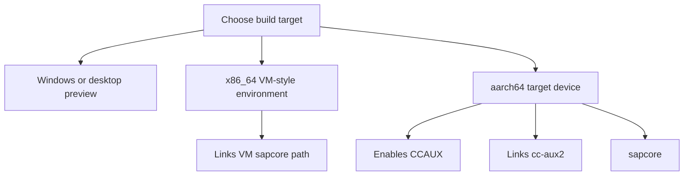

# Build And Run

This document covers the expected build environments for `UiHmiV710`.



## Requirements

Minimum development requirements:

- Qt `6.4` or newer
- CMake `3.16` or newer
- Qt Quick / QML modules
- A valid Qt Creator kit or command-line CMake toolchain

For full hardware integration you will also need:

- CrossControl headers under `/opt/crosscontrol/include`
- CrossControl runtime libraries under `/opt/crosscontrol/...`
- A compatible VM or target device for hardware-dependent behavior

## Supported Development Modes

The project is currently useful in three main modes:

- Windows or desktop preview for UI work
- x86_64 CrossControl VM-style environment
- aarch64 target device build with full `CCAux` integration

## Qt Creator Workflow

1. Open the repository root or `CMakeLists.txt` in Qt Creator.
2. Choose a Qt 6 kit.
3. Configure the project.
4. Build and run `appUiHmiV710`.

Notes:

- If Qt Creator keeps stale CMake state, remove the old build directory and
  configure again.
- Do not import an old build unless it matches the current source tree and kit.

## Command-Line Build

Example:

```powershell
cmake -S . -B build
cmake --build build
```

If Qt is not found, make sure the selected kit or `CMAKE_PREFIX_PATH` points to
your Qt installation.

## Build Behavior By Target

The build changes behavior based on `CMAKE_SYSTEM_PROCESSOR`.

### `aarch64`

When targeting `aarch64`, the build:

- enables the `CCAUX` compile definition
- links against `cc-aux2`
- links against `sapcore`
- installs the runtime under `/opt/appUiHmiV710/...`

This is the path intended for real hardware behavior.

### `x86_64`

When targeting `x86_64`, the build:

- links against the VM `sapcore` library path
- does not enable the `CCAUX` compile definition in the current CMake file

This setup is useful for UI work and partial integration work without requiring
the real target hardware path.

## Runtime Entry Point

The application boots through `main.cpp` and loads:

```text
qrc:/UiHmiV710/main.qml
```

That QML entry point acts as the top-level shell and loads the section pages
through a `StackView`.

## Practical Notes

- A desktop run is excellent for layout, navigation, and dialog work.
- Hardware-dependent handlers will not behave exactly the same outside the
  intended target environment.
- The project mixes general UI work and device-specific integration by design.

## Troubleshooting

- Missing Qt packages usually means the chosen kit is incomplete.
- Missing CrossControl headers or libraries usually means the target environment
  is not prepared for device integration.
- If the app fails to create the root object, verify the QML resources listed in
  `qml.qrc` and the QML files registered in `CMakeLists.txt`.
