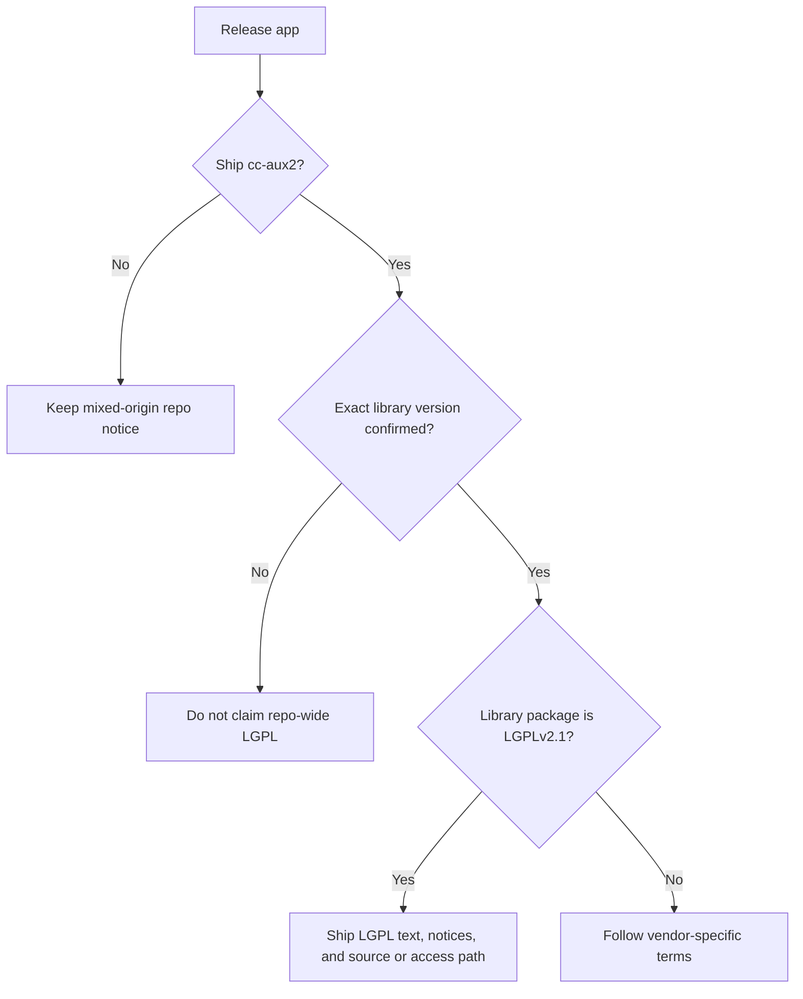

# Legal And Third-Party Notes

This document records the current licensing and redistribution notes we were
able to verify for `UiHmiV710`.

This is a project compliance note, not legal advice.

## Executive Summary

- The repository does not currently declare a single root open-source license
  for all files.
- Several files in `CCAux/` and other C++ sources contain CrossControl AB
  copyright notices and `All rights reserved` headers.
- The build can link against a vendor library named `cc-aux2` from
  `/opt/crosscontrol/...`.
- CrossControl's official CCAux API documentation states that the license of
  the API and related sources changed to `LGPLv2.1` in version `2.20.0.0`.
- CrossControl's official CCAux API documentation states that support for
  `510/710` was added in version `2.19.0.0`.

Because of that version split, the exact `cc-aux2` package version being
redistributed should be verified before claiming LGPL-based rights for the
shipped library or for any copied vendor source files.

## Confirmed Local Evidence

The following repository facts were directly verified:

- `CMakeLists.txt` includes CrossControl headers from
  `/opt/crosscontrol/include`
- `CMakeLists.txt` links the app against `cc-aux2`
- files under `CCAux/` include notices such as
  `Copyright (C) 2020 CrossControl AB`
- the repository history shows the `CCAux/` directory was imported as a single
  block rather than developed incrementally in this repository

## Safe Interpretation

For project maintenance and release documentation, the safe interpretation is:

- treat `CCAux/` and `cc-aux2` as third-party/vendor materials
- do not label the entire repository as LGPL
- if only the shipped runtime library is confirmed as LGPL, document that
  library separately instead of relicensing the repository

## Why The Repository Uses `docs/LICENSES.md` Instead Of A Root `LICENSE`

A single root `LICENSE` file would wrongly suggest that one license applies to
everything in the repository. Based on the currently verified evidence, that
would be misleading.

Instead, the project uses:

- [../LICENSE](../LICENSE) as the root repository notice
- [LICENSES.md](LICENSES.md) as the repository entry point for license notes
- [../licenses/LGPL-2.1.txt](../licenses/LGPL-2.1.txt) as the local copy of the
  GNU LGPL v2.1 text
- this file as the explanatory legal and redistribution note

## If The Distributed `cc-aux2` Library Is LGPLv2.1

If the exact `cc-aux2` binary that ships with the app is covered by
`LGPLv2.1`, the usual practical obligations include:

- give notice that the application uses an LGPL-covered library
- provide a copy of the LGPLv2.1 license
- preserve copyright and license notices for the library
- provide the corresponding source for that LGPL library, or another
  LGPL-compliant source offer or access path
- publish any modifications made to the LGPL library itself under LGPLv2.1
- avoid adding extra restrictions that block recipients from exercising LGPL rights
- be extra careful with static linking because LGPLv2.1 adds relinking concerns
  for a work that uses the library

## Practical Release Checklist

If you publish a release that includes `cc-aux2`, the low-friction checklist is:

- include [../licenses/LGPL-2.1.txt](../licenses/LGPL-2.1.txt)
- mention in release notes or package docs that `cc-aux2` is used
- publish or bundle the exact corresponding source for the distributed
  `cc-aux2` binary, if that binary is confirmed to be LGPL-covered
- keep this repository documented as mixed-origin unless full provenance is
  later confirmed for all copied vendor source files

## What Still Needs Confirmation

The following point remains important:

- whether the copied source files in `CCAux/` were also distributed by
  CrossControl under LGPLv2.1, or whether only the runtime library/license
  terms changed for a later package version

Until that is confirmed from the actual upstream package or SDK release used by
the project, repository-wide LGPL claims should be avoided.

## Official References

- GNU LGPL v2.1 license text:
  https://www.gnu.org/licenses/old-licenses/lgpl-2.1.html
- GNU LGPL v2.1 plain-text copy:
  https://www.gnu.org/licenses/old-licenses/lgpl-2.1.txt
- GNU GPL FAQ entry on LGPL static vs dynamic linking:
  https://www.gnu.org/licenses/gpl-faq.html#LGPLStaticVsDynamic
- CrossControl CCAux API `2.20.0.0` documentation:
  https://crosscontrol.com/manual/CCAux%20API/2.20.0.0/index.html
- CrossControl CCAux API `2.19.0.0` documentation:
  https://crosscontrol.com/manual/CCAux%20API/2.19.0.0/index.html

## Interpretation Notes

- The statement that the CCAux API license changed to `LGPLv2.1` comes from the
  official CrossControl `2.20.0.0` API documentation.
- The statement that `510/710` support was added in `2.19.0.0` comes from the
  official CrossControl `2.19.0.0` API documentation.
- The recommendation to verify the exact shipped `cc-aux2` version is an
  inference based on those two official version notes.
