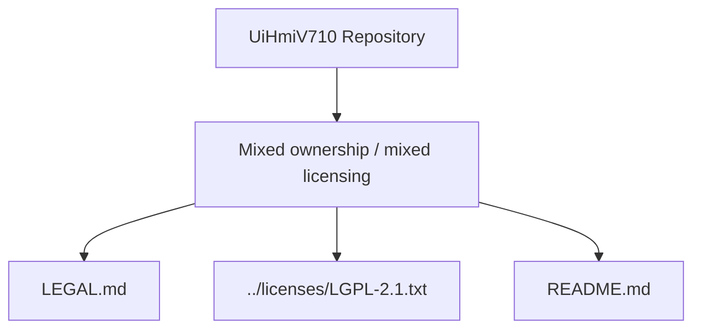

# Licenses

This repository does not currently publish a single repository-wide
open-source license file for all content.

Use this file as the entry point for licensing and redistribution notes.

## Why There Is No Single Root `LICENSE`

- The repository contains mixed-origin code.
- Several files include third-party/vendor copyright notices.
- The build can link against vendor libraries such as `cc-aux2`.
- A third-party library being LGPL does not automatically make the whole
  repository LGPL.

## Where To Look

- Root repository notice: [../LICENSE](../LICENSE)
- Legal and third-party notes: [LEGAL.md](LEGAL.md)
- Documentation index: [README.md](README.md)
- Local copy of the GNU LGPL v2.1 text: [../licenses/LGPL-2.1.txt](../licenses/LGPL-2.1.txt)

## Current Practical Status

- Treat `CCAux/` and `cc-aux2` as third-party/vendor materials unless exact
  upstream provenance is confirmed.
- If you distribute an LGPL-covered `cc-aux2` binary with the app, include the
  LGPL text and follow the redistribution notes in [LEGAL.md](LEGAL.md).
- Do not add a root `LICENSE` that claims the whole repository is LGPL unless
  provenance and licensing for all affected files have been verified.
