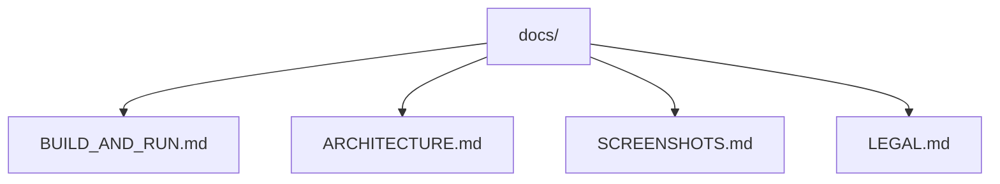

# Documentation

This folder contains the main project documentation for `UiHmiV710`.

The root [README.md](../README.md) is intentionally short. The detailed
technical, operational, and legal notes live here.

## Documentation Map

- Build and run: [BUILD_AND_RUN.md](BUILD_AND_RUN.md)
- Architecture: [ARCHITECTURE.md](ARCHITECTURE.md)
- Screenshot gallery: [SCREENSHOTS.md](SCREENSHOTS.md)
- Legal and third-party notes: [LEGAL.md](LEGAL.md)
- License index: [LICENSES.md](LICENSES.md)

## Project Overview

`UiHmiV710` is a Qt Quick HMI for CrossControl-style devices. The application
has three main layers:

- QML UI for navigation, feature pages, dialogs, and reusable controls
- C++ backend objects exposed to QML
- hardware-facing handlers that integrate with CrossControl APIs on supported
  targets

The application is currently designed around an `800x480` touch-oriented layout
and exposes the main navigation sections:

- `Setup`
- `Diagnostic`
- `Connection`
- `Info`

## Repository Layout

- `backend/` contains the main backend objects and support classes exposed to QML
- `CCAux/` contains handlers for backlight, buzzer, front LED, power, and
  version reporting
- `components/` contains shared QML controls and the on-screen keyboard
- `pages/sections/` contains the primary navigation shell pages
- `pages/features/` contains the individual feature screens
- `graphics/` contains icons and bitmap assets
- `docs/img/` contains screenshots used by the documentation

## What To Read First

- If you want to run the app locally, start with [BUILD_AND_RUN.md](BUILD_AND_RUN.md)
- If you want to understand how the UI and C++ pieces connect, read
  [ARCHITECTURE.md](ARCHITECTURE.md)
- If you need release or redistribution guidance, read [LEGAL.md](LEGAL.md)

## UI Preview

