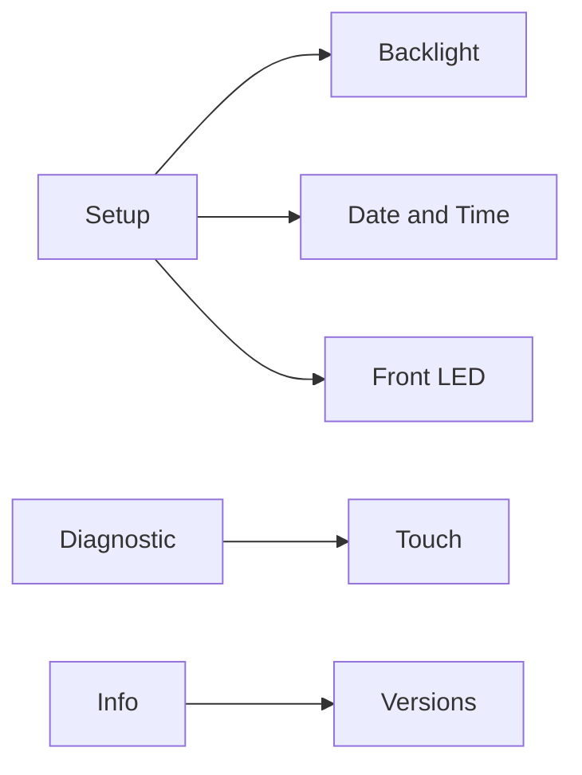
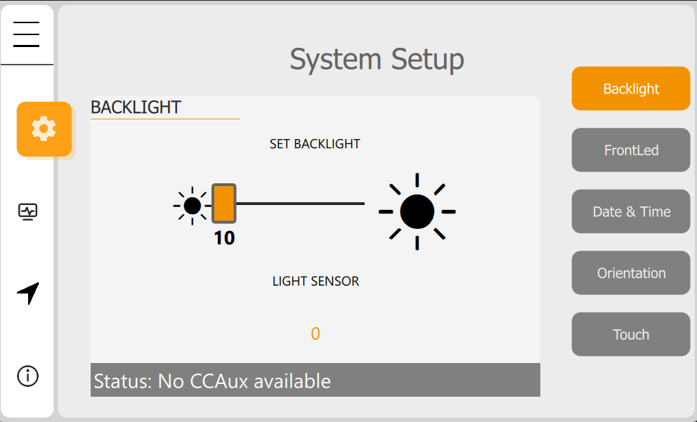
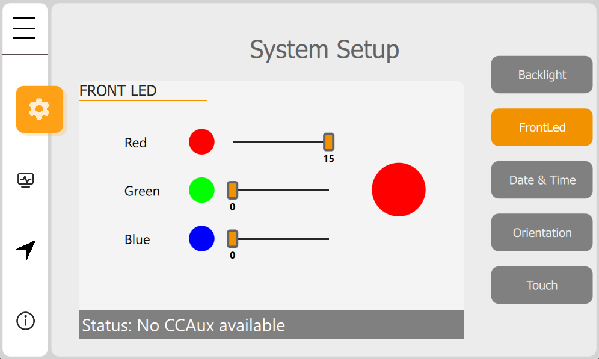
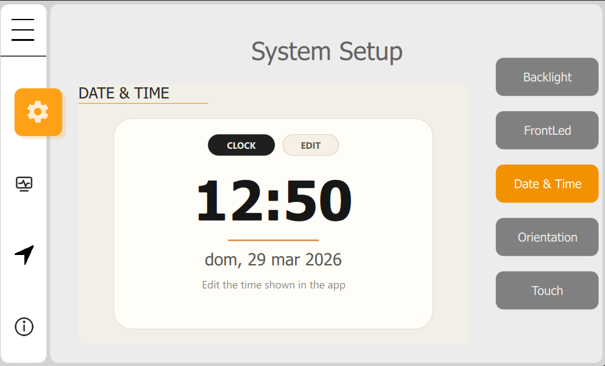
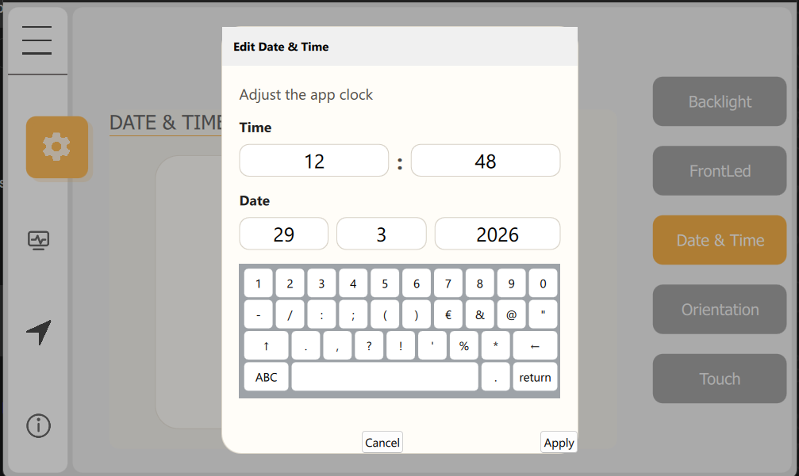

# Screenshot Gallery

This page collects the current documentation screenshots stored under
`docs/img/`.

## Backlight

Backlight control screen for brightness-related interaction and preview.

## Front LED

Front LED control screen for device status light behavior.

## Date And Time

Date and time screen used to review and update device time settings.

## Edit Date Dialog

Date editing dialog shown from the date/time workflow.
